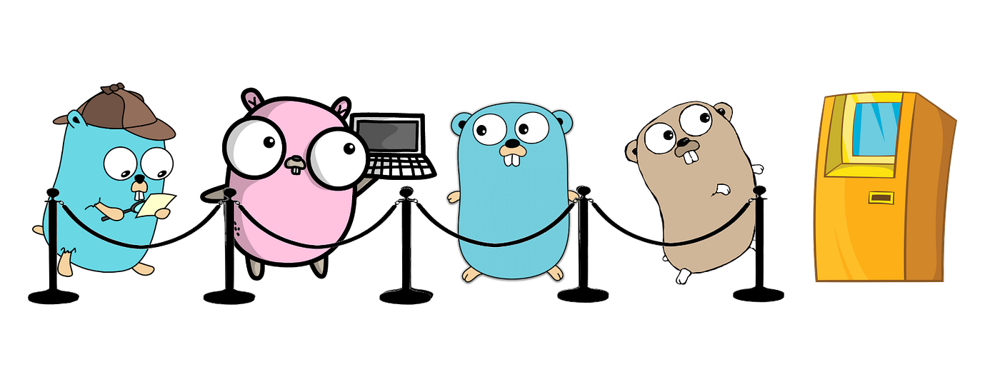

  

# Queues in Go

A Queue is a special kind of a linked list where each new element is inserted to the head
and removed from the tail of the linked list. We do not need a figure to describe a queue;
imagine going to a bank and waiting for the people that came before you to finish their
transactions before you can talk to a bank teller. That is a queue!

The main advantage of queues is simplicity! You only need two functions to access a queue,
which means that you have to worry about fewer things going wrong and you can
implement a queue any way you want so long as you can offer support for those two
functions!
