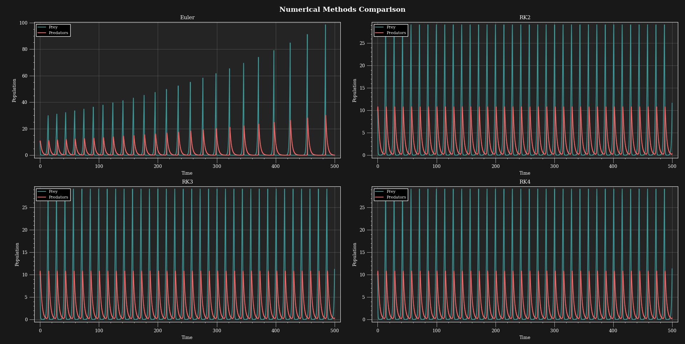
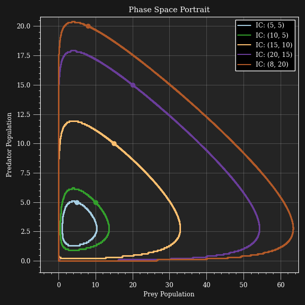

# Predator-Prey Lotka-Volterra Model

The famous Predator-Prey model, also know as the Lotka-Volterra model, is a simplified dynamic simulation of a biological system. This simple system contains only 2 species, know as predator and prey. The population of each group depnds on the other. This relation is described mathematicaly as below:

$$\frac{dx}{dt} = \alpha x - \beta xy$$
$$\frac{dy}{dt} = - \gamma x + \delta xy$$

where $x$ and $y$ represent preys and predetors population respectively. Parameters $\alpha$, $\beta$, $\delta$, and $\gamma$ are positve constants.

Write a program to plot the population of two groups over time. To solve the ODEs, you could use RK4, Euler, Huen, or any other methods available.

## Solution

To solve ODEs in the form of $y' = f(x,y)$, one can use the Taylor series or the Runge-Kutta expansion:
- Taylor series:
$$y{i+1} = y_i + hy'_i + \frac{h^2}{2!}y''_i + ... + \frac{h^n}{n!}y^{(n)}_i$$

- General form of Runge-Kutta:
$$y_{i+1} = y_i + ak_1 + bk_2 + ck_3 + dk_4$$

Regarding these 2 general expansions, we have the following methods:

### Euler
$$y_{i+1} = y_i + hy'_i$$

### Runge-Kutta 2
$$y_{i+1} = y_i + \frac{1}{2}(k_1 + k_2)$$
$$k_1 = hf(x_i,y_i)$$
$$k_2 = hf(x_i + h, y_i + k_1)$$

### Runge-Kutta 3
$$y_{i+1} = y_i + \frac{1}{6}(k_1 + 4k_2 + k_3)$$
$$k_1 = hf(x_i,y_i)$$
$$k_2 = hf(x_i + \frac{h}{2}, y_i + \frac{k_1}{2})$$
$$k_3 = hf(x_i + h, y_i + 2k_2 - k_1)$$

### Runge-Kutta 3
$$y_{i+1} = y_i + \frac{1}{6}(k_1 + 2k_2 + 2k_3 + k_4)$$
$$k_1 = hf(x_i,y_i)$$
$$k_2 = hf(x_i + \frac{h}{2}, y_i + \frac{k_1}{2})$$
$$k_3 = hf(x_i + \frac{h}{2}, y_i + \frac{k_2}{2})$$
$$k_4 = hf(x_i + h, y_i + k_3)$$

The resulting figures are as below:

In addition, the changing trend of Prey vs. Predator population could be plotted for various initial condition setups. By using a proper solver (not Euler since it doesn't result in a repeating cycle solution), the population changes in repeating loops like below:

