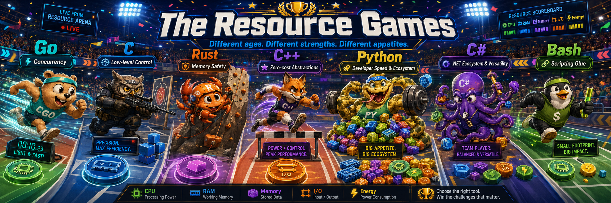

<div align="center">



# Programming Mastery

### Learn by building. Improve by sharing. Master programming through practice.

A collaborative repository where developers from different backgrounds, technology stacks, and experience levels solve programming problems using the languages they want to master.

Each contributor works through problems independently, documents their approach, and shares what they learned along the way.

</div>

---

## About the project

The main principle of this repository is simple:

> Try to understand and solve the problem yourself before reaching for a quick answer.

The goal is not only to produce working code. It is to strengthen:

* Problem-solving skills
* Critical thinking
* Algorithmic reasoning
* Code quality
* Technical documentation
* Git and collaboration practices
* Familiarity with different programming languages

Different languages may solve the same problem in very different ways. Those differences are part of the learning experience.

---

## Languages

Solutions may currently be added in:

<p align="center">


</p>

New languages are welcome.

---

## Repository structure

Please give sufficient attention to the proposed repository structure.

It may initially seem unnecessary or bureaucratic, but maintaining a consistent structure is valuable practice in discipline, documentation, collaboration, and long-term project maintenance.

```text
Programming-Mastery/
├── Python/
├── C/
├── C++/
├── Rust/
├── bash/
├── Go/
└── C#/
```

The repository is organized by programming language. Each language directory contains one folder for each problem or project.

```text
<language>/
├── README.md
├── problem-one/
│   ├── README.md
│   └── source-files
└── problem-two/
    ├── README.md
    └── source-files
```

Each language directory should contain:

* `README.md` — a list of available problems with links to their directories
* `<problem-name>/` — a self-contained project or problem directory
* `<problem-name>/README.md` — documentation for the solution
* Source files, tests, configuration files, and other required project files

Problem directories may contain as many files as necessary.

---

## Adding a new problem

### 1. Choose a language directory

Use an existing top-level directory:

```text
Python/
C/
C++/
Rust/
bash/
Go/
C#/
```

Create a new language directory when the required language is not already available.

Keep directory naming consistent with the existing repository structure.

### 2. Create a problem directory

Use a short and descriptive name.

Examples:

```text
Unit-Converter/
binary-tree/
http-server/
sorting-algorithms/
```

Related problems may be grouped inside a category directory when appropriate.

Example:

```text
bash/
└── network-tools/
    ├── port-scanner/
    └── dns-lookup/
```

### 3. Add a problem README

Every problem directory must contain a `README.md`.

The README should explain:

* The problem
* The intended behavior
* The chosen approach
* Important implementation decisions
* Requirements and dependencies
* How to build the project
* How to run the project
* Example input and output
* Known limitations, when applicable

Existing problem documentation can be used as a reference, such as:

```text
C/binary-tree/README.md
Python/Monopolistic-Theater/README.md
```

### 4. Add the source code

Keep every solution self-contained inside its problem directory.

Use proper Git practices:

* Make focused commits
* Commit regularly
* Avoid placing thousands of unrelated changes in one commit
* Do not commit generated files unless they are required
* Do not commit secrets, passwords, API keys, or environment files
* Add appropriate entries to `.gitignore`
* Test the solution before submitting it

Use clear and informative commit messages.

Examples:

```text
feat(python): add unit converter solution
fix(c): prevent memory leak in binary tree cleanup
docs(go): add build and usage instructions
test(rust): add parser edge-case tests
refactor(bash): simplify network validation
```

### 5. Update the language README

Add the new problem to the `List of Problems` section inside the corresponding language's `README.md`.

Example:

```md
## List of Problems

- [Binary Tree](./binary-tree/)
- [Unit Converter](./Unit-Converter/)
- [HTTP Server](./http-server/)
```

---

## Recommended problem README template

````md
# Problem Name

## Problem

Describe the problem clearly.

## Approach

Explain how the solution works and why this approach was selected.

## Project structure

```text
problem-name/
├── README.md
├── source-file
└── test-file
````

## Requirements

List required tools, compilers, runtimes, packages, or dependencies.

## Build

Explain how to build or compile the project.

## Run

Explain how to run the solution.

## Example

Show example input and output.

## Tests

Explain how to run the tests.

## What I learned

Document important lessons, challenges, or discoveries.

````

---

## Contribution workflow

Create a new branch before starting your work:

```bash
git switch -c feature/<language>-<problem-name>
````

Make your changes and review them:

```bash
git status
git diff
```

Stage and commit the changes:

```bash
git add .
git commit -m "feat(<language>): add <problem-name> solution"
```

Update your branch with the latest remote changes:

```bash
git fetch origin
git rebase origin/main
```

Push the branch:

```bash
git push -u origin feature/<language>-<problem-name>
```

Then open a pull request.

---

## Pull request checklist

Before submitting a pull request, confirm that:

* [ ] The solution is stored in the correct language directory
* [ ] The problem has its own directory
* [ ] The problem includes a complete `README.md`
* [ ] Build and run instructions have been tested
* [ ] The language README has been updated
* [ ] The code is readable and reasonably organized
* [ ] No credentials, secrets, or unnecessary generated files were committed
* [ ] Commit messages clearly describe the changes
* [ ] The pull request focuses on one problem or related set of changes

---

## Code quality

There is often more than one correct solution.

Contributors are encouraged to prioritize:

* Correctness
* Readability
* Simplicity
* Appropriate naming
* Useful comments
* Input validation
* Error handling
* Testing
* Clear documentation

Optimized solutions are welcome, but unnecessary complexity should be avoided.

---

## Code of conduct

Be respectful when reviewing or discussing another contributor's work.

Constructive feedback should explain:

* What could be improved
* Why the improvement matters
* How it could be improved

The purpose of this repository is learning, experimentation, and mutual growth.

---

## License

Add the repository's license information here.

A common choice for open-source learning repositories is the MIT License.

---

<div align="center">

### Think first. Build carefully. Document clearly. Share what you learn.

Made with curiosity, discipline, and code.

</div>
